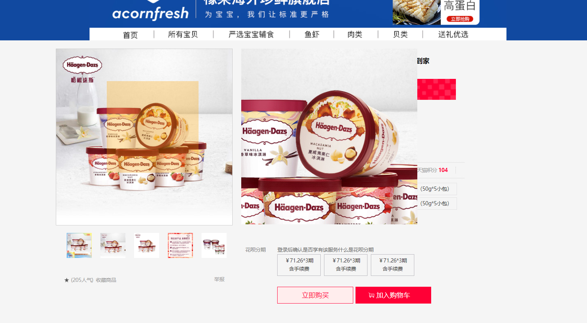

## 1、项目运行
    1、首先确保自己安装gitbash,node运行环境
    2、git clone + 需要拷贝的项目的github网址
    3、然后在项目文件夹运行gitbash
    4、输入命令 npm i (等待下载node_module依赖文件)
    5、完成后输入命令 gulp dev 运行项目即可在项目给出的本地服务器环境中查看本项目的运行效果
    6、登录的账号 用户：paopao123 密码：paopao123   用户:test123 密码：test123

## 2、注意事项：
    1. 点击天猫头部的logo可以直接返回首页
    2. 点击用户名可以直接到登录页
    3. 点击**喵鲜生**进入商品列表页
    4. 点击喵鲜生的国际大牌下的前几个商品可以有页面整体渲染的效果，其他页面都视情况采用的局部渲染效果（太懒数据json文件数据不完整）
    5. 点击商品列表的logo上的首页可以回到商品列表页
    6. 吸顶效果出不来刷新下就可以了，加载速度问题

## 效果图：
 -  效果：
    
    1. 
    2. 
    3. 
    4. 
    5. 
  

>                                        ----------paopao的著作